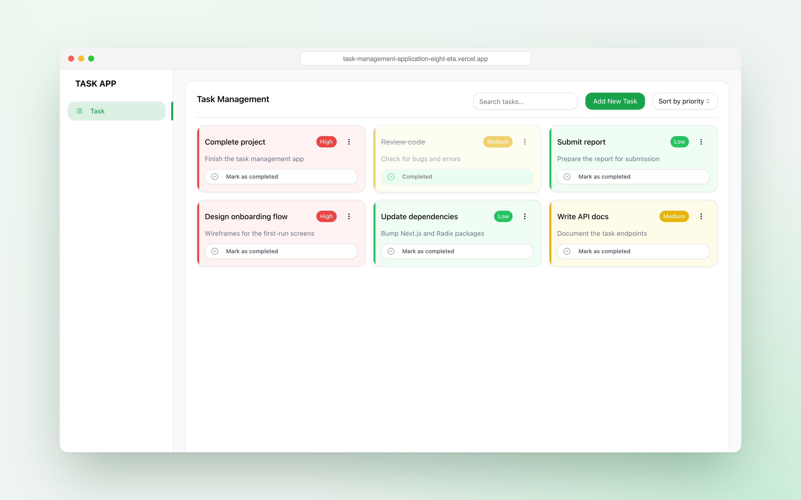
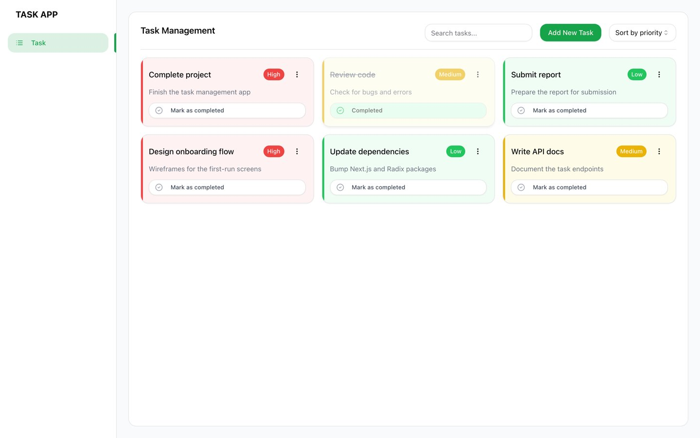
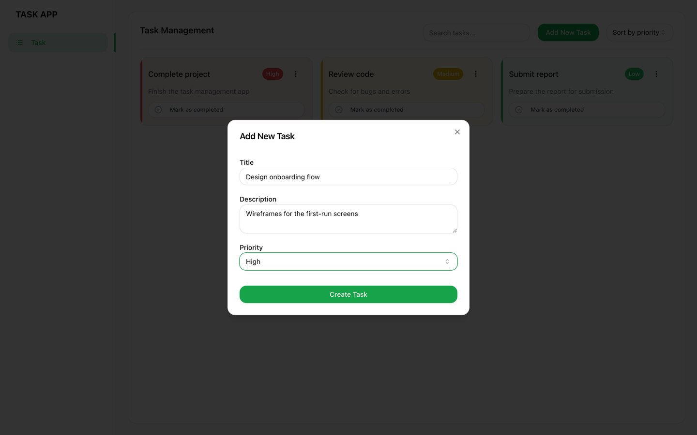
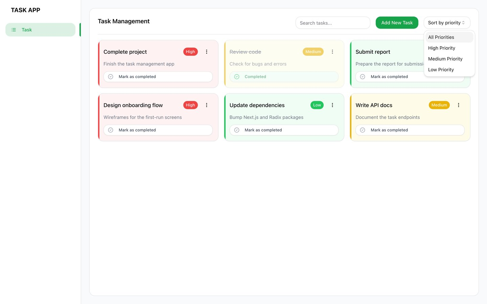
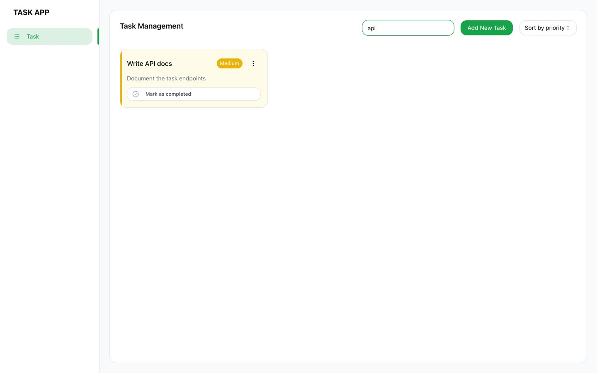

# Task Manager

A task board built with Next.js 14 (App Router), Tailwind CSS and shadcn/ui. Add, edit, complete, delete, search and sort tasks by priority.

**[Live demo](https://task-management-application-eight-eta.vercel.app)**



## Features

- Add and edit tasks in a dialog with a title, description and priority
- Mark tasks as completed, or delete them from the card menu
- Color-coded cards for high, medium and low priority
- Sort by priority
- Search tasks by title or description
- Initial tasks load in a server component, with a loading screen while they arrive

## Screenshots

| Board | Add task |
|---|---|
|  |  |

| Sort | Search |
|---|---|
|  |  |

## Tech stack

Next.js 14 · React 18 · Tailwind CSS · shadcn/ui (Radix) · Lucide icons

## Project structure

```
src/
├── app/
│   ├── (task_management)/
│   │   ├── page.js          # server component, loads the initial tasks
│   │   ├── loading.js       # loading screen
│   │   └── TaskManager.js   # client state: add, edit, delete, complete, sort, search
│   └── components/          # TaskCard, TaskList, TaskSearch, TaskSortSelect, AddEditTaskDialog, Sidebar
└── components/ui/           # shadcn/ui primitives
```

## Run locally

```bash
npm install
npm run dev
```

Then open http://localhost:3000.

## Notes

Tasks are kept in React state, so changes reset when the page reloads. The initial tasks come from a mock function in `page.js` that can be swapped for a real API.
